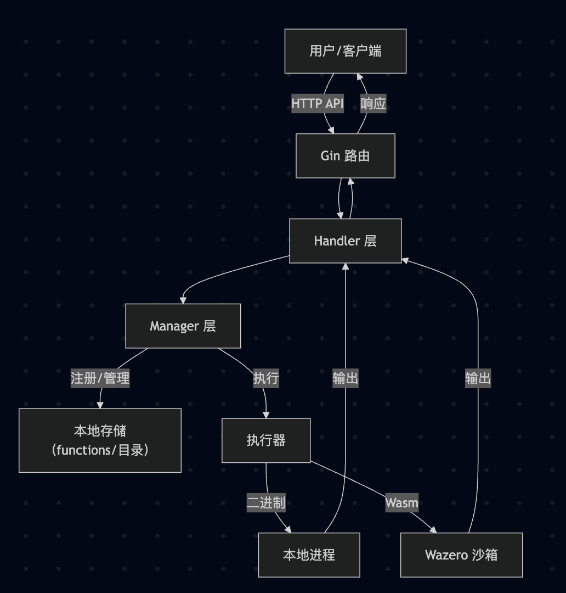
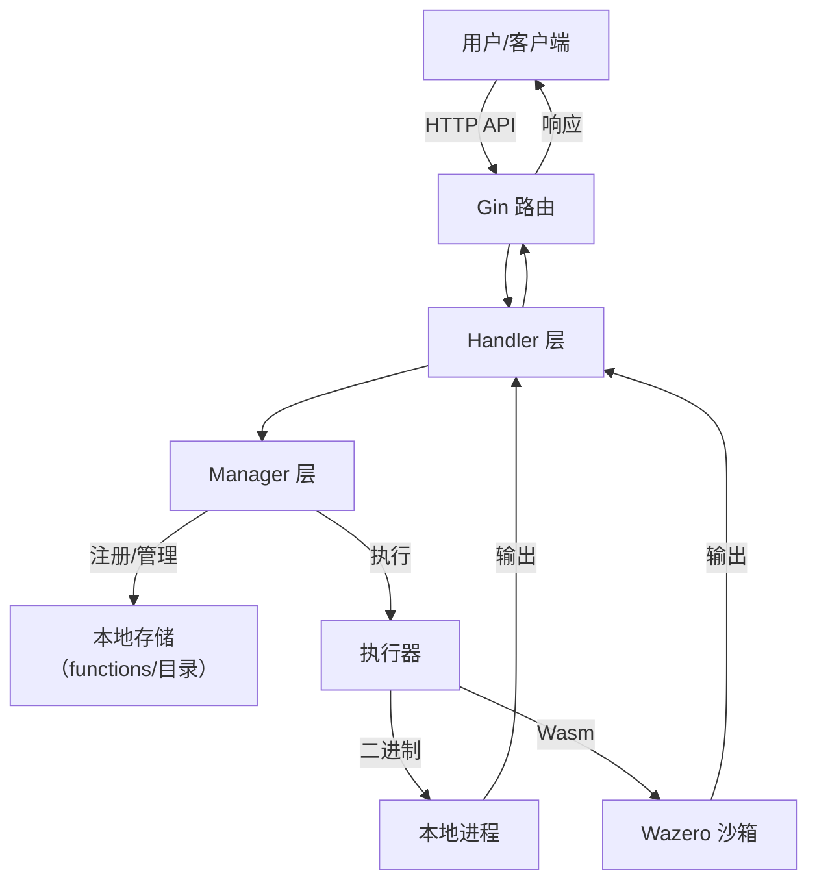

# Go Serverless 函数计算平台

本项目是一个用 Go 实现的 Serverless 函数计算平台，支持函数的上传、管理和安全执行。平台支持将 Go 函数编译为本地二进制或 WebAssembly (Wasm)，并通过沙箱机制保障运行安全。

## 功能特性

- 支持函数源码（.go）、zip 包或二进制文件上传
- 自动编译为本地可执行文件和 Wasm 沙箱文件
- Wasm 沙箱隔离，提升多租户安全性
- RESTful API 管理和调用函数
- 支持函数的版本管理
- 支持函数的注册、查询、删除、调用等操作

## 目录结构

```
.
├── main.go                // 启动入口
├── router.go              // 路由定义
├── handler/               // HTTP 处理器
├── manager/               // 函数与进程管理
├── model/                 // 数据模型
├── storage/               // 存储相关
├── util/                  // 工具类
├── functions/             // 已注册函数存储目录
└── config/                // 配置文件
```

## 快速开始

1. **环境准备**

   - Go 1.20+
   - [tinygo](https://tinygo.org/)（用于编译 wasm）
   - [gin](https://github.com/gin-gonic/gin)（已在 go.mod 中声明）

2. **启动服务**

   ```sh
   go run main.go
   ```

   默认监听 `:8080`。

3. **API 示例**

   - 注册函数（POST `/functions`，支持上传 .go/.zip(包含 .go/go.mod 项目压缩包)/.bin 文件）
   - 查询函数列表（GET `/functions`）
   - 查询单个函数（GET `/functions/:id`）
   - 删除函数（DELETE `/functions/:id`）
   - 调用函数（POST `/invoke/:id`，参数 `input`）

4. **函数目录结构**

   每个函数以 `functions/<name>/<version>/` 形式存储，包含：
   - `main.bin`：本地可执行文件
   - `main.wasm`：Wasm 沙箱文件
   - `meta.json`：元数据

## Wasm 沙箱机制

- 使用 [wazero](https://github.com/tetratelabs/wazero) 运行时，隔离函数执行环境
- 仅开放标准输入输出，禁止访问宿主文件、网络、环境变量等敏感资源
- 支持资源限制（如超时、内存上限）

详细原理见 [README.md](README.md) 沙箱说明部分。

## 适用场景

- Serverless 函数计算
- 多租户安全代码执行

## 参考

- [gin](https://github.com/gin-gonic/gin)
- [wazero](https://github.com/tetratelabs/wazero)
- [tinygo](https://tinygo.org/)

---

## 架构图





- 用户通过 HTTP API 上传、调用、管理函数
- Gin 路由分发请求到 Handler
- Handler 调用 Manager 进行函数注册、查询、删除、执行等操作
- Manager 负责函数元数据管理和本地存储
- 执行时，支持本地二进制或 Wasm 沙箱（Wazero）两种模式
- 执行结果返回给用户

> 你也可以将此 mermaid 图粘贴到 [Mermaid Live Editor](https://mermaid.live/) 查看可视化效果。